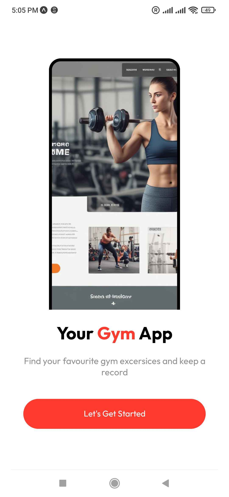
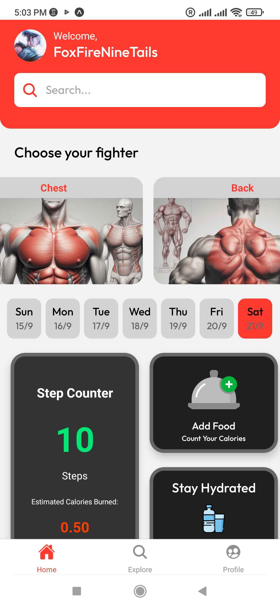
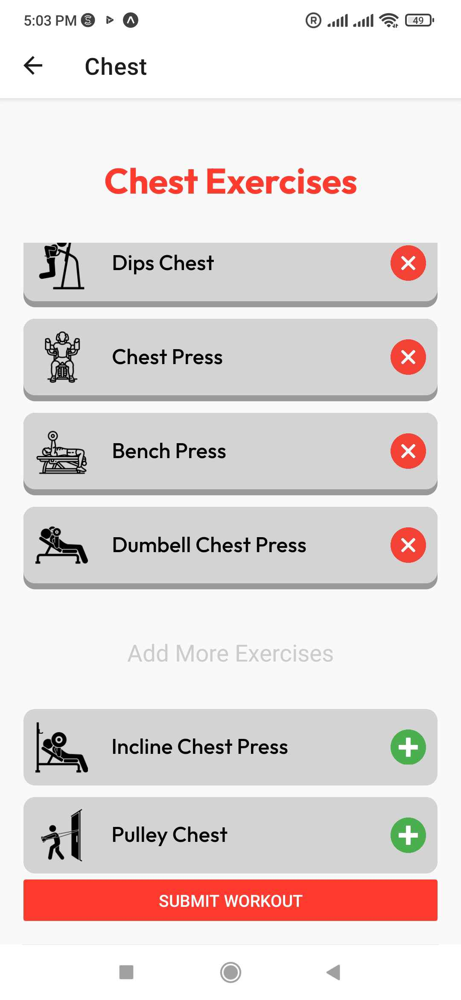
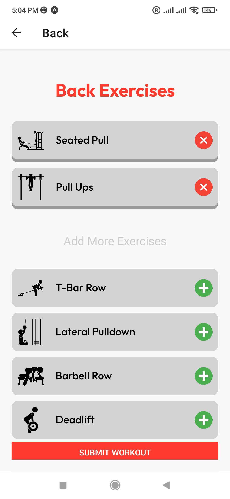
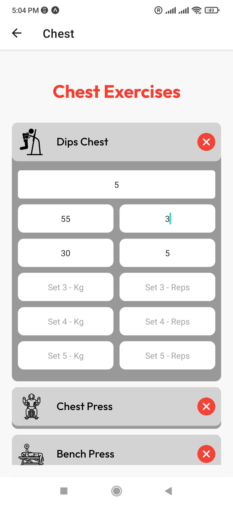

# Gym App

Welcome to the Gym App, a fitness tracking application built using **Expo React Native** and **Firebase**. This project helps users track their workouts, step count, water and food intake, and overall fitness progress.

## Table of Contents

- [Features](#features)
- [Screenshots](#screenshots)
- [Contact](#contact)

## Features

- **Google Authentication**: Log in and sign up using Firebase Google Auth.
- **Exercise Management**:
  - Track exercises under **Chest**, **Back**, and **Legs** categories.
  - Add sets, reps, and weight (kgs) for each exercise.
- **Daily and Weekly Tracking**:
  - View a **7-day tracker** with the current day highlighted, displaying the date.
- **Step Counter**:
  - Monitor your steps and see an estimate of **calories burned**.

## Screenshots

### Landing Page

### Home Page

### Chest Page

### Back Page

### Chest Page Sets

## Contact

For any questions or feedback, please contact:

- **Your Name**: foxfireninetails9@gmail.com
- **GitHub**: [qbeeeeee](https://github.com/qbeeeeee)
